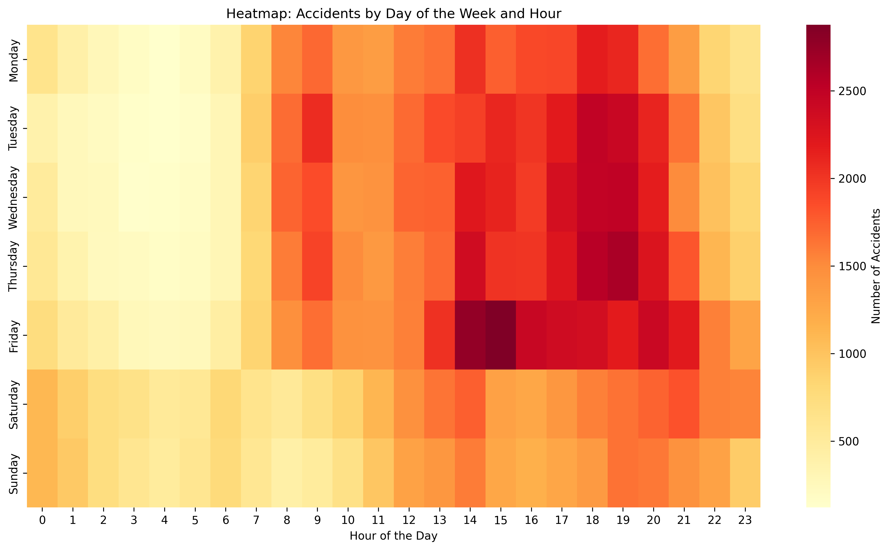
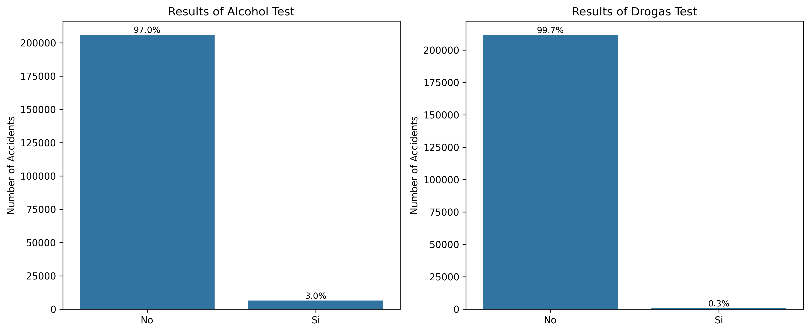
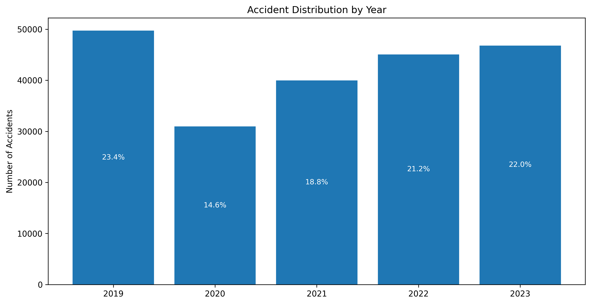

# EDA of Traffic Accidents in Madrid (2019-2023)
Dataset available at: 
 [Accidentes de Tráfico de Madrid españa 2019 a 2023](https://www.kaggle.com/datasets/jairoordezpacheco/accidentes-de-trfico-de-madrid-espaa-2019-a-2023)

### Analysis Approach
This exploratory data analysis (EDA) was conducted in three main stages:

1. Data cleaning, formatting, and standardization of the traffic accident dataset.
2. Summarization and visualization of key variables to identify trends and patterns for further analysis.
3. Temporal pattern analysis to explore accident distribution across different hours, days, and months (time series analysis).

#### An amount of 212511 registers were evaluated for this analysis, evaluating 10 features:
- Date
- District
- Type of accident
- Weather conditions
- Vehicle type
- Age range
- Gender
- Level of injuries
- Alcohol test
- Drugs test

## Summary of Key Insights
1. Accidents are more frequent in densely populated districts such as Puente de Vallecas and Salamanca.

2. Most accidents involve private cars and motorcycles, with frontal-lateral and rear-end collisions being the most common types.

3. Weather conditions do not significantly influence accident occurrence, as most accidents happen under clear weather.

4. The majority of victims are men aged 25-49 years old.

5. Alcohol and drugs do not appear to be strongly associated with recorded accidents, based on available data.

6. Traffic accidents peak in the evening hours (18:00-19:00), especially on Fridays.

7. COVID-19 lockdowns had a clear impact on accident trends in 2020, with a gradual recovery in subsequent years.

## Key Findings
### General Trends
Districts with the Highest Number of Traffic Accidents:
1. Puente de Vallecas (7.8%)
2. Salamanca (7.5%)
3. Chamartín (7%)
4. Ciudad Lineal (6.5%)
5. Carabanchel (6.4%)

### Most Common Types of Accidents
1. Frontal-lateral collision (25.3%)
2. Rear-end collision (23.9%)
3. Side collision (14.7%)
4. Collision with a fixed obstacle (11.3%)

### Weather Conditions
The majority of accidents occurred under clear weather conditions (75.6%), with soft rain and cloudy with shares of 5.7% each, suggesting that weather did not play a significant role in accident occurrence.

### Most Affected Vehicle Types
Passenger cars (68.6%), 125cc motorcycles (6.8%), and vans (6.7%) were the most frequently involved vehicle types in accidents.

### Injury Severity Data
The available data on injury severity was not particularly useful due to its low coverage. In most cases, injury severity was not recorded (43.7%) and no medical assistance in 30.7%, limiting its analytical value.

### Age Groups of Accident Victims
The most affected age groups ranged from 25 to 49 years old (52.2%), followed by 50-59 years old (15.5%) and 21-24 years old (6.9%), with a clear underrepresentation of children and elderly individuals.

### Gender Distribution
A higher proportion of accident victims were men (62.1%).

### Alcohol and Drug Tests
The dataset showed no strong correlation between alcohol or drug consumption and accident occurrence (>97% in both cases), as most recorded cases did not involve positive test results.

## Time Series Analysis
This part of the analysis revealed meaningful patterns in accident frequency over time of evaluation (2019-2023).

### Yearly Trends
- The highest number of traffic accidents was recorded in 2019 (23.4%), followed by 2023 (22%).
- A significant drop in accidents occurred in 2020 (14.6%)), likely due to mobility restrictions during the COVID-19 pandemic.
- From 2021 onwards, accident numbers increased gradually (2.5% of average increase).

### Monthly Trends
- The three months with the highest accident counts were October (9.8%), November, and December with 9.6% each.
- August recorded the lowest rates (5.5%), probably due to the general holiday season.
- 
### Weekly Trends
- Fridays had the highest number of accidents (16.9%), followed by Thursdays (15.3%), Wednesdays (14.9%), and Tuesdays (14.8%).
- Saturdays, Mondays, and Sundays recorded the lowest accident frequencies, with 13.1%, 13.5% and 11.6% respectively.

Hourly Trends
- The peak accident hours were 19:00, 18:00 (7.1% each) and 14:00 (6.9%), with  which likely correlate with school schedules and end-of-work hours.
- Hourly patterns by day of the week:
    1. Fridays: Showed an overall increase in accidents from 13:00 to 21:00, with a peak between 14:00 and 15:00.
    2. Tuesday to Thursday: Accidents were more concentrated between 18:00 and 21:00, followed by a gradual decline in the 12:00 to 17:00 and 08:00 to 09:00 time slots.

